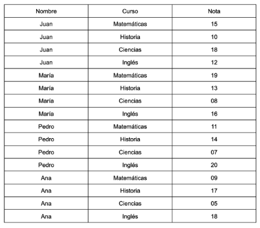

# Ejemplo 

Se tiene un conjunto de estudiantes con las notas de sus exámenes de 4 cursos y necesitamos saber para cada
estudiante el promedio de sus notas y cuántos y cuáles cursos han aprobado y jalado con la consideración de que para aprobar se necesitan una nota mayor a 11.

* [Solución en Java](./java-example/)
* [Solución en Python](./python-example/)
* [Solución en C#](./csharp-example/)
* [Solución en NodeJS](./nodejs-example/)
