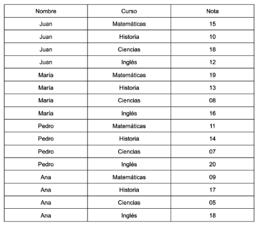

# Exemplo

Temos um conjunto de alunos com notas de exames de 4 cursos e precisamos saber para cada um
aluno a média de suas notas e quantas e quais disciplinas foram aprovadas e reprovadas, considerando que para aprovação é necessária nota superior a 11.

* [Solução em Java](./java-example/README.pt.md)
* [Solução em NodeJS](./nodejs-example/README.pt.md)
